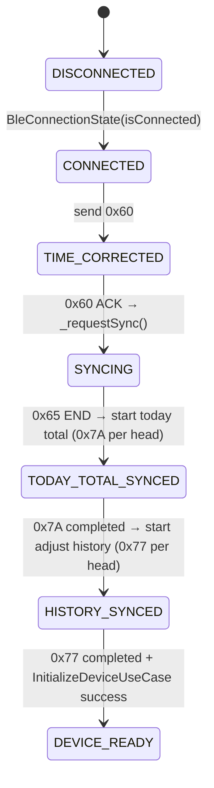

## BLE Lifecycle Audit

### 1. Lifecycle sequence

| Step | Trigger | Command | Opcode | File |
| --- | --- | --- | --- | --- |
| 1 | `BleConnectionState` stream reports `isConnected && !wasConnected` | `DeviceConnectionCoordinator._onDeviceConnected` calls `DosingCommandBuilder.timeCorrection` | `0x60` | `lib/app/device/device_connection_coordinator.dart` |
| 2 | `BleDosingRepositoryImpl._handleTimeCorrectionAck` receives ACK for 0x60 | `_requestSync` issues `DosingCommandBuilder.syncInformation` via `_sendCommand` | `0x65` | `lib/data/dosing/ble_dosing_repository_impl.dart` |
| 3 | `_finalizeSync` invoked when sync END notice arrives | `_startTodayTotalsSequence` cycles over heads calling `_sendCommand` with `getTodayTotalVolume` | `0x7A` (per head) | `lib/data/dosing/ble_dosing_repository_impl.dart` |
| 4 | After all heads produce 0x7A responses, `_startAdjustHistorySequence` runs | `_requestNextAdjustHistory` sends `getAdjustHistory` per head | `0x77` (per head) | `lib/data/dosing/ble_dosing_repository_impl.dart` |
| 5 | `_logLifecycle('BLE_DEVICE_READY')` logged when `_requestNextAdjustHistory` finishes | Implicit readiness / UI assumes `InitializeDeviceUseCase` completed | N/A | `lib/data/dosing/ble_dosing_repository_impl.dart` + `lib/app/device/device_connection_coordinator.dart` |

### 2. State diagram

### 3. Race conditions / risks

- **Notifications vs. lifecycle commands:** `DeviceConnectionCoordinator` writes 0x60 as soon as the connection stream reports `CONNECTED`, but notification enabling still occurs on the native side. If 0x60 fires before `onOpenNotify` (or `BleNotifyBus` listener setup) completes, the ACK may arrive before the Dart layer is ready to parse it, delaying `_requestSync` or masking the ACK entirely.
- **Duplicate sync requests:** Both `BleDosingRepositoryImpl._handleConnectionState` (on `state.isConnected`) and `_handleTimeCorrectionAck` call `_requestSync()`. Even though `BleSyncGuard`/`session.syncInFlight` try to serialize, the guard is reset to `false` before `_requestSync` is triggered on the connection event, so the second call can race with the first and enqueue two 0x65 commands back-to-back.
- **Stale queue entries across reconnects:** `BleAdapterImpl` keeps a global `_queue` that is not cleared on disconnect. A new connection may reuse the same `BleAdapterImpl`, so commands belonging to the prior session (e.g., a late _sendCommand from a timed-out 0x7A) may still be in `_queue` and fire after the new connect, risking cross-device interleaving. There is no `clear()` bound to disconnect to flush `_queue`.

### 4. Notes

- `BleAdapterImpl._processQueue` guarantees that each command goes through `_executeCommand`, `_performWriteWithTimeout`, and is logged with `BLE_SEND`/`BLE_QUEUE`, so the lifecycle commands are serialized and monitored.  
- Each `_sendCommand` call that targets dosing opcodes adds a 200 ms delay for parity with Android, ensuring the queue does not surge with back-to-back lifecycle commands.  
- The `DeviceConnectionCoordinator` ensures `InitializeDeviceUseCase` runs only after 0x60, so the `CurrentDeviceSession` becomes ready (`session.isReady`) only after the BLE lifecycle completes.  
