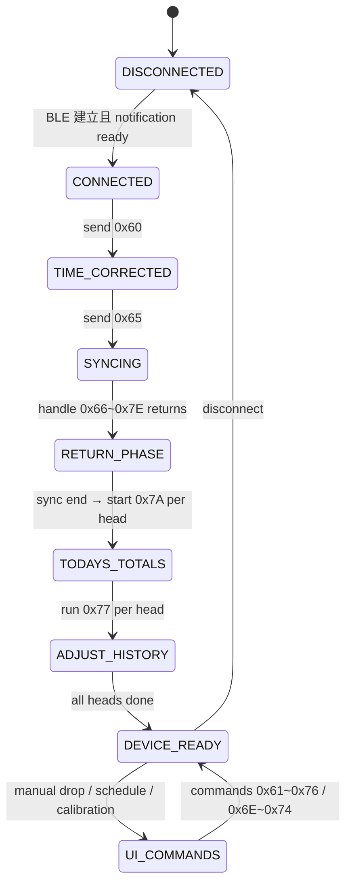

# Dosing BLE Flow（koralcore）

描述 Dosing 連線後的 BLE 生命周期：從 `DeviceConnectionCoordinator` 的通知 guard、時間校正、同步，再到每日總量與校正歷史的序列，並補充 UI 產生的命令（排程、手動滴液、校準）。

## 1. 連線→就緒步驟

| 步驟 | 觸發點 | 命令 / 動作 | 備註 |
| --- | --- | --- | --- |
| 1. 連線並等待通知 | `DeviceConnectionCoordinator` 監聽 `BleAdapterImpl` 的 `BleNotifyBus`，`isNotificationReady` 只有在 dosing notify characteristic 發訊息後才 true。 | `bleAdapter.clearQueue()`（斷線時） + `await _awaitNotificationReady()` | 這段 guard 防止在還沒開通知前送 0x60，並避免 `_onDeviceConnected()` 重複執行。 |
| 2. 時間校正 | `DeviceConnectionCoordinator._onDeviceConnected()` | `0x60` (`DosingCommandBuilder.timeCorrection()`) | 須在通知 ready 後才送，ACK 由 `_handleTimeCorrectionAck()` 檢查 |
| 3. 同步請求 | `_handleTimeCorrectionAck()`（收到 ACK 且成功） | `0x65` (`DosingCommandBuilder.syncInformation()`) | `_requestSync()` 設 `session.syncInFlight=true` 並要求 `BleSyncGuard` |
| 4. RETURN 資料 | BLE notification `0x66~0x7E` | `_handle...` 依 opcode 更新 `session` | 例如 `_handleReturnDelayTime` 更新 `delayTime`；`_handleReturnTodayTotalVolume` 等會把資料寫進 `session` |
| 5. Sync 結束 | device 回 `0x65` `data[2]==0x02` | `_finalizeSync()`：將 `session.syncInFlight=false`，`_startTodayTotalsSequence()` | `BleSyncGuard.finishSync()` 並 emit UI stream |
| 6. Today total / Adjust history | `_startTodayTotalsSequence()` → `_requestNextTodayTotal()` → `_startAdjustHistorySequence()` | `0x7A` + `0x77` 依 pump head count 逐一查詢 | `pumpHeadCount` 由 `PumpHeadRepository.listPumpHeads()` 決定 |
| 7. Device ready | 所有 head 的 0x7A/0x77 完成 | `session.pendingAdjustHistoryHeadNo == null` → `session.isReady = true` | log `BLE_DEVICE_READY` 讓 UI 解鎖操作（如 manual drop、schedule） |

## 2. UI 相關命令

- **Manual drop**（`DosingMainController.toggleManualDrop()`）: 建立 `DosingCommandBuilder.manualDropStart/End()` → 0x63 / 0x64 → `bleAdapter.writeBytes()`。
- **Delay time**（`DropSettingController.save()`）: 先更新儲存，連線且 ready 則呼叫 `commandBuilder.setDelayTime()` → 0x61。
- **Rotating speed**（`PumpHeadSettingsController._updateRotatingSpeed()`）: `commandBuilder.setRotatingSpeed()` → 0x62。
- **Schedule 排程命令**（`DosingScheduleController`）: `singleDropImmediately`（0x6E）、`singleDropTimely`（0x6F）、`h24DropWeekly`（0x70）、`h24DropRange`（0x71）、`customDropWeekly`（0x72）、`customDropRange`（0x73）、`customDropDetail`（0x74），這些方法會在 `PumpHeadRecordSettingController.saveSchedule()` 驗證完成後依據種類呼叫對應 `create*`。
- **Calibration**（`PumpHeadAdjustController`）: `startCalibration()` 送 0x75 `startAdjust` 並啟動 21 秒倒數；`completeCalibration()` 發 0x76 `adjustResult`（volume ×10）。

## 3. Dosing Flow Diagram

## 4. 補充

- `BleDosingRepositoryImpl` 在發送 0x60 以上命令前會 `await Future.delayed(200 ms)`，同步 Android 行為。
- `_ensureDoseCapabilityConfirmed()` 會在 `session.doseCapability == unknown` 時送 0x7E 探測 pump head 格式，並在完成後更新 capability flag。
- `_startTodayTotalTimeout()` / `_startAdjustHistoryTimeout()` 以 5 秒「避免卡住」；逾時會重新呼叫 `_requestNext...`。

