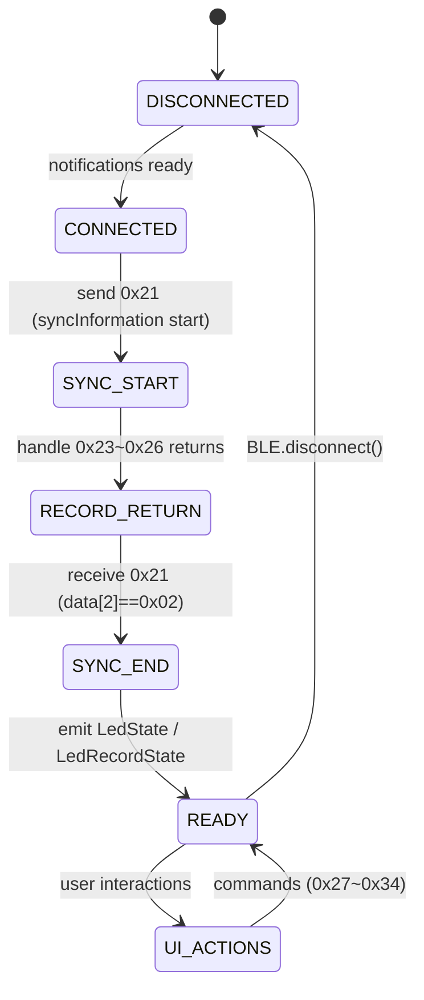

# LED BLE Flow（koralcore）

此篇描述 `BleLedRepositoryImpl` 的連線→初始化→同步→就緒流程，並示意常見的 UI 命令如何疊加於 lifecycle 上。

## 1. 連線生命周期

| 步驟 | 觸發點 | 命令 / 動作 | 備註 |
| --- | --- | --- | --- |
| 1. Session 建立 | 控制器首次觀察 `observeLedState` / `observeLedRecordState` | `_ensureSession()` → `_requestSync()` | 權限檢查靠 `BleSyncGuard`，每次連線或 refresh 都會重新觸發 |
| 2. Sync start | `_requestSync()` | `0x21 (syncInformation)` | 補入 `data[2]=0x01` 表示 start，BLE 通知回來後 repository 直接更新 `LedState` 與 `LedRecordState` |
| 3. 回傳資料 | notification | `0x23` / `0x24` / `0x25` / `0x26` / `0x23` 等 | `handleSceneReturn` / `handleRecordReturn` 等 handler 解讀 payload 並寫入 cache |
| 4. Sync end | device 發送 `0x21` 且 `data[2]=0x02` | `_finalizeSync()` | 清除 sync flag、發送 stream、準備接受 UI 操作 |
| 5. UI 操作 | 各控制器 (record/schedule/scene/slider) | `0x27` / `0x28`~`0x2B` / `0x32`~`0x34` / `0x33` / `0x2E` / `0x30` | 對應 `LedCommandBuilder` 封裝的 payload，皆以 `BleAdapterImpl.writeBytes()` 送出 |

### LED 漫遊命令示意
- `setRecord`（0x27）：`LedRecordTimeSettingController` 或 `InitLedRecordUseCase` → `ledRecordRepository.setRecord()` → `BleLedRepositoryImpl` → `_commandBuilder.setRecord()`。
- `applyScene`（0x28/0x29）：`LedSceneListController.applyScene()` → `ApplySceneUseCase` → `BleLedRepositoryImpl.applyScene()` → `usePresetScene()` / `useCustomScene()`。
- `preview`（0x2A）：`LedRecordController` / `LedSceneListController` START/STOP preview → `startPreview()` / `stopPreview()`。
- `dimming`（0x32/0x33/0x34）：`EnterDimmingModeUseCase` / `SetChannelIntensityUseCase` / `ExitDimmingModeUseCase` 形成 `0x32+0x33+0x34` 的迴圈，常見於 `LedControlPage` 的滑桿與 `LedRecordTimeSettingPage` 的 `setSl*Light`。

## 2. LED Flow Diagram

## 3. 觀察

- `BleLedRepositoryImpl` 會在 `session.ensureProcessing(_processQueue)` 建立一個同步 stream 處理通知，保證順序一致。
- Sync 結束 (`LedStatus.idle`) 後即可接受 `applyScene`、`setRecord` 等命令，UI 層會在 `session.isReady` true 時開放按鈕。
- 當進入/離開調光模式時，`EnterDimmingModeUseCase`/`ExitDimmingModeUseCase` 會再一次呼叫 `BleAdapter`（`BleAdapterImpl.write()`）維持 0x32/0x34 有序。

